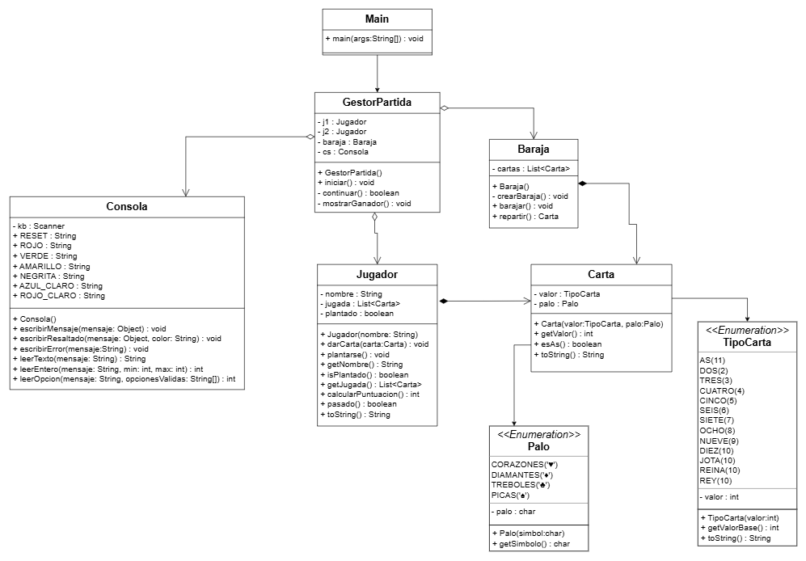

# ♠️ BlackJack Simplificado

## ✍️ Desarrollador
Sara Rojas Gámez

1º DAM - Entornos de Desarrollo

---

El programa consiste en una implementación en **Java** del juego **BlackJack** pero simplificado para 2 jugadores, ejecutado por consola y desarrollado utilizando **Programación Orientada a Objetos (POO)**.

---

## 📌 Objetivo

El objetivo del juego es alcanzar **21 puntos** o acercarse lo máximo posible **sin pasarse**.  
Los jugadores pueden decidir en cada ronda si **pedir una carta** o **plantarse**.

---

## 🎮 Reglas del juego

### Valor de las cartas

- Cartas **2–10** → valor numérico.
- **J, Q, K** → valen **10 puntos**.
- **As** → vale **1 u 11**, según el valor más favorable para el jugador.

### Ganador

- Gana quien esté **más cerca de 21 sin pasarse**.
- Si ambos tienen la misma puntuación → **empate**.
- Si ambos superan 21 → **empate**.
- Si solo uno se pasa → **gana el otro jugador**.

---

## 🕹 Funcionamiento

1. El programa pide el nombre de los 2 jugadores.
2. Se indica cuántas cartas iniciales se reparten (1 o 2).
3. Se reparten las cartas de forma aleatoria de una baraja de 52 cartas previamente creada y barajada.
4. El juego avanza por rondas donde cada jugador decide:
   - **Carta (C)**
   - **Plantarse (P)**

El juego termina cuando ambos jugadores se plantan o cuando se puede determinar el ganador.

---

## 🧱 Diseño

El proyecto está desarrollado siguiendo **POO** y aplicando principios básicos **SOLID**, separando responsabilidades entre las diferentes clases del juego.

Se ha diseñado también un **diagrama UML**, incluido en el repositorio en formato PDF. Es el siguiente:

---

## ▶️ Ejemplo de ejecución

    Nombre del jugador 1: 
    sara
    Nombre del jugador 2: 
    Patri
    ¿Cuantás cartas queréis para empezar? (1 o 2)
    2
    
    --- RONDA 1 ---
    sara: [7♠, 2♦] -> Puntos: 9
    Patri: [4♠, 10♣] -> Puntos: 14
    
    ------------------------------------------------------
    sara, ¿Quieres carta (C) o quieres plantarte (P)
    c
    Patri, ¿Quieres carta (C) o quieres plantarte (P)
    c
    
    --- RESULTADO FINAL ---
    sara: [7♠, 2♦, 9♠] -> Puntos: 18
    Patri: [4♠, 10♣, J♠] -> Puntos: 24
    
    GANADOR: sara

